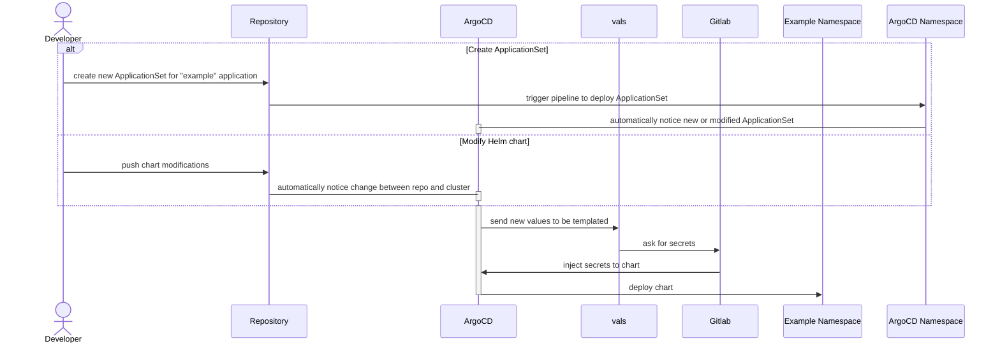

# Notes on ArgoCD Applications

This repository stores the ApplicationsSets that will be deployed on ArgoCD. The ArgoCD instance contains the **vals** plugin which can be used to retrieve secrets from Gitlab CI Variables (see below).

## Workflow

We consider those components:

- Gitlab CI Variables (or Gitlab): Key Value secret manager.
- [ArgoCD](https://argo-cd.readthedocs.io/en/stable/): GitOps operator that automatically watches the drift between the Kubernetes cluster and the Gitlab repositories.
- [helm-secrets with vals](https://github.com/helmfile/vals): ArgoCD Plugin to inject Gitlab values during deployments. Its integration was done with the help of [its official documentation](https://github.com/jkroepke/helm-secrets/wiki/ArgoCD-Integration).



## Storing secrets in Gitlab

ArgoCD uses `vals` to inject Gitlab values on a project, which is transparent for the Helm/Kubernetes developer. You only have to set:

- the [ApplicationSet](https://argo-cd.readthedocs.io/en/stable/operator-manual/applicationset/):

  ```yaml
  ---
  apiVersion: argoproj.io/v1alpha1
  kind: ApplicationSet
  metadata:
    name: example
    namespace: argocd
  spec:
    generators:
      - list:
          elements:
            - namespace: "shared"
              project: "prod"
              branch: "main"
    template:
      metadata:
        name: "example-{{ project }}"
        namespace: argocd
      spec:
        project: "{{ project }}"
        syncPolicy:
          automated:
            prune: true
            allowEmpty: true
          syncOptions:
            - CreateNamespace=true
        sources:
          - chart: example
            repoURL: https://charts.registry.com/
            targetRevision: 1.2.3 # Version of the chart
            helm:
              releaseName: my-release
              valueFiles:
                - $values/components/example/values.ref.yaml # One global values file
                - $values/components/example/values.{{ project }}.yaml # One values file per environment, potentially containing secrets references with vals
          - repoURL: "https://git.instance.com/my/repo.git" # Do not forget '.git'
            targetRevision: "{{ branch }}" # Git repository branch
            ref: values
        destination:
          server: https://kubernetes.default.svc
          namespace: "{{ namespace }}"
  ```

- values with reference to Gitlab variables keys. The `123456` is the project ID of your Gitlab repository:

  ```yaml
  # values/values-ssg-dev.yaml
  my_big_secret: ref+gitlab://git.instance.com/123456/my-variable # This way, vals wil retrieve the value of "my-variable"
  other_value: "my value"
  another_one: 738
  ```

- on Gitlab, the defined secret. It is recommended to set them using Tofu, especially if an application needs generated credentials.

:::info
Vals is also compatible with other backends, if you do not want to use Gitlab CI Variables, you can find the complete list of supported backends in the [official documentation](https://github.com/helmfile/vals?tab=readme-ov-file#supported-backends).
:::
