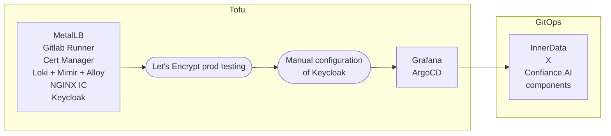

# Infrastructure installation

## Overview

This guide provides installation instructions, usage guidelines, and troubleshooting tips for the main Kubernetes infrastructure used in the InnerData X Confiance.AI project. The components covered include OpenTofu scripts and Helm Charts.
What is called _Kubernetes Infrastructure_ in this project is the set of middleware applications needed to manage InnerData and Confiance components. Main Helm charts required to enable security, observability, and GitOps practices. Clone the present repository locally.

:::info
OpenTofu is used in this project as [Terraform is no longer a FOSS tool](https://www.hashicorp.com/license-faq). The scripts may be compatible with Terraform but we do not guarantee it.
:::

Deployed applications during this section:

|  Application  |                     Helm repo                      |      Chart name       |   Namespace   | Host                       |
| :-----------: | :------------------------------------------------: | :-------------------: | :-----------: | -------------------------- |
|    ArgoCD     |        https://argoproj.github.io/argo-helm        |        argo-cd        |    argocd     | `argocd.<BASE_DOMAIN>`     |
| Cert-Manager  |             https://charts.jetstack.io             |     cert-manager      | cert-manager  |                            |
|  Alloy Stack  |       https://grafana.github.io/helm-charts        |    k8s-monitoring     |     alloy     |                            |
|    Grafana    | https://prometheus-community.github.io/helm-charts | kube-prometheus-stack |    grafana    | `monitoring.<BASE_DOMAIN>` |
|     Loki      |       https://grafana.github.io/helm-charts        |         loki          |     loki      |                            |
|     Mimir     |       https://grafana.github.io/helm-charts        |   mimir-distributed   |     mimir     |                            |
| Gitlab Runner |              https://charts.gitlab.io              |     gitlab-runner     | gitlab-runner |                            |
| Ingress NGINX |     https://kubernetes.github.io/ingress-nginx     |     ingress-nginx     | ingress-nginx |                            |
|   Keycloak    |         https://charts.bitnami.com/bitnami         |       keycloak        |   keycloak    | `auth.<BASE_DOMAIN>`       |
|    MetalLB    |         https://metallb.github.io/metallb          |        metallb        |    metallb    |                            |

### Structure

The `infra/` directory contains the infrastructure-related files and configurations required to deploy and manage the Kubernetes infrastructure for the InnerData X Confiance.AI project. This includes OpenTofu scripts, Helm values, Terraform configurations, and other necessary resources to set up and maintain the infrastructure.

```shell
infra/
├── helm-values/
│   ├── argocd.ref.yaml
│   ├── argocd.override.yaml
│   ├── loki.ref.yaml
│   ├── loki.override.yaml
│   └── ...
├── modules/
│   └── helm/
│       ├── main.tf
│       └── variables.tf
├── .terraform.lock.hcl
├── main.tf
├── providers.tf
├── secrets.tf
└── variables.tf
```

- **helm-values/**: Contains Helm values files for various components such as ArgoCD, Loki, MetalLB, Mimir, and NGINX. These files define the configuration and values used during the Helm chart deployments. There is always a pair of values files: the `.ref.yaml` containing the original values from the chart regristry, and the `.override.yaml` which are modified following our needs, and which will take precedency during the deployment.
- **modules/**: Contains reusable Tofu modules for deploying Helm charts and managing component secrets.

  - `helm/`: Module for deploying Helm charts using Tofu.

- **main.tf**: Main Tofu configuration file that defines the infrastructure resources and their dependencies.
- **providers.tf**: Defines the required Tofu providers and their versions.
- **secrets.tf**: Contains Tofu configurations for managing Kubernetes secrets and Gitlab CI variables for both middlewares and components.
- **variables.tf**: Defines the input variables used in the Tofu configurations.

This structure ensures that the infrastructure setup is modular, reusable, and easy to manage, providing a clear separation of concerns and facilitating the deployment and maintenance of the Kubernetes infrastructure.

## Infrastructure prerequisites

- Have admin access to a Kubernetes cluster
- Have access to an S3-compatible storage system
- Created a domain name and be able to change the A entry to point towards NGINX Ingress Controller Load Balancer service IP address
- If the environment is only accessible through a VPN, make sure you have a compatible endpoint with Cert-Manager Let's Encrypt DNS01 challenge mechanism

## Installation

### Prerequisites

Install tofu (version >= 1.9) locally or use the tofu Docker image. The latter will be used throughout the installation steps. The state can be stored everywhere (but locally), the preferred places being in an S3-compatible storage, or using [Gitlab state backend](https://docs.gitlab.com/ee/user/infrastructure/iac/terraform_state.html). See [OpenTofu documentation](https://opentofu.org/docs/language/settings/backends/http/#configuration-variables) for backend configuration.

Ensure you have access to the Kubernetes cluster and set it as your current context.

The `infra/` directory contains the instructions to deploy a set of Helm charts resources with OpenTofu. Create a Gitlab CI variable of type "File" called `MAIN_TFVARS`, and fill following variables:

```hcl
# Local Kubernetes context name pointing to desired Kubernetes cluster
kube_context = ""
# Gitlab Runner registration token (See https://docs.gitlab.com/runner/register/#register-with-a-runner-registration-token-deprecated)
gitlab_reg_token = ""
# Gitlab repository's access token, used to add CI variables
gitlab_project_token = ""
# Gitlab Project ID
gitlab_project_id = 7934
# Grafana admin password
grafana_admin_password = ""
# Corporate email address for Let's Encrypt certificate request
le_email_address = ""
# Gitlab URL
gitlab_url = ""
# Gitlab ArgoCD user
gitlab_argocd_user = ""
# Gitlab ArgoCD token
gitlab_argocd_token = ""
# Corporate email address for Let's Encrypt certificate request
le_email_address = ""
# Ingress class name
ingress_class_name = ""
# Keycloak cluster issuer
kc_cluster_issuer = ""
# Docker Hub server. Leave it empty or set it to your private registry.
container_registry_server = ""
# Docker Hub username
container_registry_username = ""
# Docker Hub password
container_registry_password = ""
# Internal container registry server
internal_container_registry_server = ""
# Internal container registry username
internal_container_registry_username = ""
# Internal container registry password
internal_container_registry_password = ""
# Grafana OAuth client ID created in Keycloak
grafana_oauth_client_id = ""
# Grafana OAuth client secret created in Keycloak
grafana_oauth_client_secret = ""
# Base domain name. Example: etf-foundation.com
base_domain = ""
# Keycloak Realm name
realm_name = ""
# Helm secrets image tag
helm_secrets_image_tag = ""
# Cert challenge DNS01 application key
cert_challenge_dns01_application_key = ""
# Cert challenge DNS01 secret name
cert_challenge_dns01_secret_name = ""
# Cert challenge DNS01 consumer key
cert_challenge_dns01_consumer_key = ""
# Cert challenge DNS01 endpoint
cert_challenge_dns01_endpoint = ""
# Cert challenge DNS01 group name
cert_challenge_dns01_group_name = ""
# Cert challenge DNS01 solver name
cert_challenge_dns01_solver_name = ""
# External S3 region
s3_region = ""
# External S3 access key ID
s3_access_key_id = ""
# External S3 secret access key
s3_secret_access_key = ""
# External S3 endpoint
s3_endpoint = ""
# JupyterHub client secret created later in Keycloak. Can be set to null at the beginning.
jupyterhub_client_secret = null
# MinIO client secret created later in Keycloak. Can be set to null at the beginning.
minio_client_secret = null
# Argo Workflows client ID created later in Keycloak. Can be set to null at the beginning.
workflows_sso_client_id = null
# Argo Workflows client secret created later in Keycloak. Can be set to null at the beginning.
workflows_sso_client_secret = null
# Docusaurus client secret created later in Keycloak. Can be set to null at the beginning.
docusaurus_client_secret = null
```

Then, create the following Gitlab CI Variables:

- To use Tofu in Gitlab CI, create a new Access Token on the project having `api` scope and at least `Developer` role. Then create a CI Variable called `TF_HTTP_PASSWORD` and having the token's value.
- For ArgoCD, follow [vals documentation](https://github.com/helmfile/vals?tab=readme-ov-file#gitlab-secrets)

### Deployment



Before installing MetalLB, see [official documentation](https://metallb.universe.tf/installation/) for specific settings depending on your infrastructure implementation. Create the [IPAddressPool](https://metallb.universe.tf/configuration/) that will allow Kubernetes Services to use the declared addresses as external IP addresses:

````yaml
apiVersion: metallb.io/v1beta1
kind: IPAddressPool
metadata:
  name: ip-pool
  namespace: metallb-system
spec:
  addresses:
    - 192.168.254.50/29
```

```shell
cd infra/
export TOFU_VERSION=1.9
sudo docker run ghcr.io/opentofu/opentofu:${TOFU_VERSION} init
sudo docker run ghcr.io/opentofu/opentofu:${TOFU_VERSION} fmt
sudo docker run ghcr.io/opentofu/opentofu:${TOFU_VERSION} validate
# Step 01: Install base infrastructure. We exclude the cluster issuers as the CRD are not currently installed and it will make tofu fail
sudo docker run ghcr.io/opentofu/opentofu:${TOFU_VERSION} plan -out main.tfplan -lock=false -exclude module.grafana -exclude module.argocd -exclude kubernetes_manifest.cluster_issuer_le_staging -exclude kubernetes_manifest.cluster_issuer_le_prod -var-file=main.tfvars
sudo docker run ghcr.io/opentofu/opentofu:${TOFU_VERSION} apply tfplan
# Step 02: Install cert-manager ClusterIssuers CRDs and OVH DNS01-challenge files (if needed, otherwise the HTTP01 would be recommended)
sudo docker run ghcr.io/opentofu/opentofu:${TOFU_VERSION} plan -out main.tfplan -lock=false -exclude module.grafana -exclude module.argocd -var-file=main.tfvars
# Step 02 - B: Follow the README on https://github.com/baarde/cert-manager-webhook-ovh for DNS01 challenge over a VPN
````

### Let's Encrypt production test

You can test your Let's Encrypt configuration after running the step 2. Follow the [Cert Manager documentation](https://cert-manager.io/docs/tutorials/acme/http-validation/#issuing-an-acme-certificate-using-http-validation) to understand why you should do so. You only have to change the value of the Tofu variable `kc_cluster_issuer` to `letsencrypt-staging`, deploy the platform and then check if the certificates are issued. If so, you can revert your changes to `kc_cluster_issuer` and deploy the platform again.

### Keycloak configuration

You now have to configure Keycloak and create the needded clients. Refer to the following guides for configuring Keycloak with ArgoCD and Grafana:

- [ArgoCD Keycloak integration](https://argo-cd.readthedocs.io/en/stable/operator-manual/user-management/keycloak/)
- [Grafana Keycloak integration](https://grafana.com/docs/grafana/latest/setup-grafana/configure-security/configure-authentication/keycloak/)

Then, refer to our [dedicated documentation](./keycloak).

Once Keycloak has been configured, you can deploy the rest of the applications using Gitlab CI. Run the jobs in the `🐋 images_build` and `🟨 tofu` stages. Please see the `.gitlab-ci.yml` file for a description of the jobs.

### ArgoCD configuration

- In ArgoCD, create a new project called `prod`
  - Add a destination: `https://kubernetes.default.svc`, `in-cluster`, `*` namespaces
  - Add source repository: `*`
- In your Git instance, create an access token for ArgoCD and copy it
- In ArgoCD, in Settings > Repositories > Connect Repo, add this repository:
  - Connection method: via HTTPS
  - Type: git
  - Project: `prod`
  - Repository URL: `https://your-instance.com/repo.git`
  - Username: `argocd`
  - Password: paste the token you generated

### Grafana configuration

Add Loki as the logs source by going to **Connections > Add new connection > Loki** and then click on _Add new datasource_. Then, set `http://loki-gateway.loki.svc.cluster.local` as the URL and click on _Save and Test_. You can now explore the logs on **Explore > Logs** or you can also import a [dedicated Grafana Hub dashboard](https://grafana.com/grafana/dashboards/13186-loki-dashboard/) on **Dashboards > New > Import**:

- Paste this number: `13186`
- Then, edit the dashboard by changing the variables:
  - `metric`: set to `kube_pod_container_info, namespace=$namespace`
  - `workload`: delete this variable

:::tip
For RBAC considerations, it is possible to create new folder Admin, restrict access Admin users only and move all the dashboards in there. Then, create or copy unrestricted dashboards in the root folder.
:::

To monitor GPU metrics, consider importing those two dashboards:

- [Kubernetes Deployment Metrics with GPU](https://grafana.com/grafana/dashboards/10646-kubernetes-deployment-metrics-with-gpu/)
- [NVIDIA DCGM Exporter Dashboard](https://grafana.com/grafana/dashboards/12239-nvidia-dcgm-exporter-dashboard/)

## Follow-up

The components are now ready to be installed. Please follow the [dedicated documentation](./install_components).
